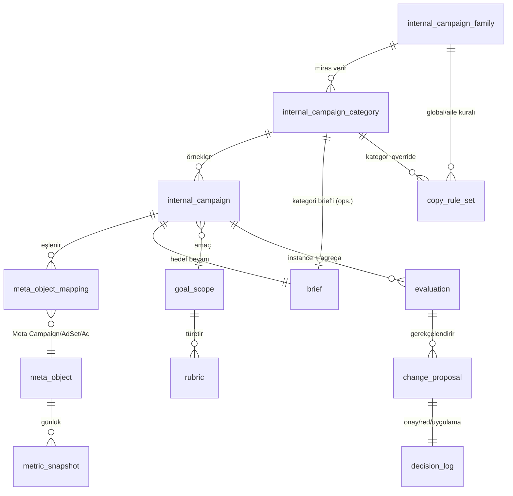

# ReklamZeka — Brief-Temelli, Kontrol-Öncelikli Meta Reklam Yardımcı Ajanı: İmplementasyon Planı

> Sürüm: v1 · 2026-08-06 · Durum: ONAYLANDI (kullanıcı, 2026-08-06) · Faz 0 uygulaması başladı.
> Oturum: ot:2026-08-06/reklamzeka-faz-0-kurulum
> Kategori: proje

## Context (neden)

Doruk Sağlık Grubu'nun Meta reklam operasyonu iki zıt dünyada koşuyor: doktor IG sayfalarından
boost (bilinirlik/takipçi) ve dönüşüm/satış hunileri (lead→offline satış). Bugün analiz ve karar
manuel; hedefler (brief'ler) kişinin kafasında; Meta'nın "campaign" terimi ile iç stratejik
kampanya kavramı sürekli çakışıyor. İstenen: Meta verisini çeken, kullanıcının brief'ine göre
değerlendiren, portföy/bütçe önerisi üreten, **her yazmayı insan onayına sunan** sürekli bir ajan.
Sağlık sektörü + Kasım 2025 mevzuatı nedeniyle otonom yayın kesinlikle yok.

**Kullanıcı kararları (2026-08-06):**
1. Plumbing: **sadece resmî Meta Ads MCP** (`mcp.facebook.com/ads`).
2. CRM: var ama **v2'ye açık kapı** — MVP'de entegrasyon yok, arayüz tasarımda hazır.
3. Uyumluluk: metin yazarlığı kısıtları **şablon/global seviyede kullanıcı tarafından tanımlanır**;
   sistem kural motorunu ve uygulama noktalarını sağlar, kural içeriğini kullanıcı yazar.
4. Onay kanalı: **Claude/CLI + otomasyon scriptlerini tetikleyebilen yerel HTML yönetim paneli**;
   Telegram digest/bildirim için kalır (onay için değil).

**Araştırma temeli (2026-08-06 doğrulandı):**
- Resmî Meta Ads MCP: Nisan 2026 açık beta, Temmuz 2026'da tüm geliştirici app'lerine açık,
  beta'da ücretsiz. Yetenek: raporlama, campaign/adset/ad create+edit, katalog, sinyal tanılama,
  A/B test, aktivite logları. **Tekil araç adları ve PAUSED garantisi resmî dokümandan
  doğrulanamadı** → Faz 0'da canlı envanter dökümü şart.
- Marketing API v26.0 (29 Tem 2026); sürüm ömrü ~1 yıl. Attribution: sadece 1d/7d click + 1d view.
  Veri saklama: unique/saatlik 13 ay, frequency 6 ay → **kendi ambarımız zorunlu**.
- Offline Conversions API öldü (May 2025); CRM geri beslemesi = Conversions API + dataset + `lead_id`.
- Advantage+ konsolidasyonu tamam: `advantage_state_info` alanı; öneri motoru bu dille konuşmalı.
- Boost'lar API'de gerçek reklamdır; `source_instagram_media_id` ile programatik boost mümkün.
  "Instagram follows" metriğinin Ads Insights API'deki alan adı **teyitsiz** → Faz 0 testi.
- Mevzuat (SB Yönetmeliği RG 12.11.2025): yurt içi hedefli sponsorlu sağlık tanıtımı dar istisnalar
  dışında yasak; ceza ≥100.000 TL / aylık brüt gelirin %2'sine kadar. KVKK 2023/787: rıza alınsa
  bile hasta verisiyle reklam hukuka aykırı bulunabilir. → Sistem karar VERMEZ; bulgular başlangıç
  kural paketi olarak sunulur, kuralları kullanıcı yazar/onaylar (karar 3).

---

## 1. Terminoloji Sözlüğü (KİLİTLİ)

§3'teki tablo aynen kilitlendi; ek terimler:

| Kavram | Standart ad | Kod adı |
|---|---|---|
| Stratejik kampanya ailesi | İç Kampanya Ailesi (İKA) | `internal_campaign_family` |
| Aile içi tür/şablon | İç Kampanya Kategorisi (İKK) | `internal_campaign_category` |
| Fiilen koşan örnek | İç Kampanya (İK) | `internal_campaign` |
| İç hedef taksonomisi | Amaç Kapsamı | `goal_scope` |
| Mecra/yerleşim | Mecra | `medium` |
| Sayfa türü / hedef varlık | Sayfa Türü | `page_type` |
| Meta platform nesneleri | Meta Campaign / Ad Set / Ad | `meta_campaign` / `meta_ad_set` / `meta_ad` |
| Meta optimizasyon hedefi | Meta Objective | `meta_objective` |
| **Ek:** hedef beyanı belgesi | Brief | `brief` |
| **Ek:** amaç kapsamından türeyen ölçüm seti | Rubrik | `rubric` |
| **Ek:** Meta nesnesi ↔ İK bağı | Eşleme Kaydı | `meta_object_mapping` |
| **Ek:** önerilen yazma işlemi | Değişiklik Önerisi (Diff) | `change_proposal` |
| **Ek:** onay/red/uygulama kaydı | Karar Günlüğü | `decision_log` |
| **Ek:** günlük metrik çekimi | Metrik Anlık Görüntüsü | `metric_snapshot` |
| **Ek:** kullanıcı-tanımlı metin kuralı | Metin Kural Seti | `copy_rule_set` |

**Sert kurallar:** çıplak "kampanya" kelimesi kodda, Sheets sekme adlarında, log'larda ve LLM
prompt'larında yasak. Lint: CI'da `rg -i '\bcampaign\b'` taraması `meta_` öneki olmayan kullanımı
FAIL eder (Python tanımlayıcıları + Sheets şema sabitleri). LLM prompt şablonlarının başına sözlük
bloku enjekte edilir.

## 2. Veri Modeli

### 2.1 Depolama ayrımı (gerekçeli)

| Depo | Ne tutar | Neden |
|---|---|---|
| **Google Sheets** (insan-okur kanon) | İKA/İKK tanımları, İK kayıt defteri, brief'ler, KPI hedefleri, rubrik override'ları, metin kural setleri, eşleme tablosu, onay kuyruğu görünümü, karar günlüğü görünümü | İnsan okur+düzenler; kullanıcının mevcut iş akışı; onay/denetim şeffaflığı |
| **SQLite** (`warehouse.db`, makine ambarı) | `metric_snapshot` zaman serileri, ham insights JSON, delta/trend hesapları, Sheets'in okuma cache'i | Meta saklama 13/6 ay → tarih kendi tarafımızda; Sheets hücre kotası zaman serisine uygun değil; hızlı sorgu |
| **Repo (git)** | Rubrik varsayılanları (YAML), şablon iskeleti şemaları, prompt şablonları, kod | Versiyonlanabilir varsayılanlar; Sheets'teki override'lar bunların üstüne biner |

Senkron yönü: Sheets = insan-yazar alanlarda kanon; script her koşuda Sheets→SQLite cache tazeler;
sistem Sheets'e yalnız **append/yeni satır** yazar (onay kuyruğu, karar günlüğü, öneri), insan
hücrelerini ezmez. Karar günlüğü append-only: hem SQLite hem Sheets'e çift yazılır.

### 2.2 Şema ve ilişkiler



**Çekirdek tablolar** (Sheets sekmeleri ≈ SQLite tabloları, alan adları kod adlarıyla):

- `internal_campaign_family`: `family_id, name, description, attribute_schema (JSON), default_goal_scopes,
  default_kpi_targets (JSON), rules (JSON), analysis_logic_ref, status`
- `internal_campaign_category`: `category_id, family_id, name, attribute_schema_override, medium[],
  page_type[], goal_scope, kpi_targets_override, budget_definition (instance|category), rules_override,
  analysis_logic_override, status`
- `internal_campaign`: `ik_id, category_id, name, page_ref, budget (amount, period, level), start/end,
  attributes (JSON — çözülmüş değil, yalnız instance override), brief_id, status`
- `brief`: `brief_id, scope (family|category|instance), owner_ref, hedef_cümlesi, kpi_targets (metric,
  target, threshold_warn, threshold_fail)[], kısıtlar, tarih, revizyon_no`
- `goal_scope`: `scope_id, name, composite_weights (hibrit için {scope_id: weight})` — açık uçlu satır ekleme
- `rubric`: repo YAML varsayılan + Sheets override; `rubric_id, goal_scope_id, metrics[{metric_key,
  source (ads_insights|ig_platform|derived), direction, weight, benchmark}]`
- `meta_object_mapping`: `mapping_id, meta_level (campaign|adset|ad), meta_id, ik_id, match_method
  (name_rule|manual|ai_suggested), confidence, verified_by_user (bool), created_at`
- `metric_snapshot` (SQLite): `snapshot_date, meta_level, meta_id, metric_key, value, raw_json_ref`
  — ham insights JSON ayrı tabloda saklanır (alan adları değiştikçe yeniden türetilebilsin)
- `evaluation`: `eval_id, scope (instance|aggregate), ik_id|category_id, period, rubric_id, scores
  (JSON), delta (JSON), verdict, rationale_text, brief_id, created_at`
- `change_proposal`: `proposal_id, eval_id, action_type (pause|scale|budget_shift|creative_refresh|
  targeting|boost_create), target_meta_ids[], diff (JSON: field, current, proposed), rationale
  (brief_id + metric_key + threshold + ölçülen değer), copy_rule_findings[], risk_flags[], status
  (pending|approved|rejected|applied|rolled_back|expired)`
- `decision_log` (append-only): `log_id, proposal_id, actor, decision, applied_at, mcp_tool_called,
  mcp_response_ref, rollback_ref`
- `copy_rule_set`: `rule_id, scope (global|family|category), pattern_type (regex|keyword|llm_check),
  pattern, severity (block|warn), açıklama, kaynak_notu, aktif (bool)` — **içerik kullanıcı yazar**;
  araştırmadan çıkan riskli-ifade listesi `başlangıç paketi (pasif)` olarak yüklenir, kullanıcı
  aktive eder/düzenler.

### 2.3 Miras/override çözümü (açık uçluluk garantisi)

Efektif konfig = `deep_merge(family, category, instance)` — instance kazanır; listeler anahtar-bazlı
birleşir; `null` üstteki değeri siler. Çözüm tek fonksiyonda (`resolve_effective_config(ik_id)`),
her değerlendirme koşusunda taze hesaplanır, hiçbir katmanda kopyalanıp donmaz. Motor hiçbir aile
adını bilmez: "Marka Doktor" ve "Satış" yalnız Sheets satırıdır. Yeni aile/kategori = Sheets'e satır
(+ istenirse AI iskelet önerisi, §4.a) — **kod değişikliği sıfır**.

## 3. Bileşen Mimarisi

Dil: **Python 3.12+**. Süreç modeli: cron→tmux ile koşan deterministik scriptler + LLM gereken
adımlarda headless `claude -p` çağrısı. MCP erişimi iki yoldan: (a) deterministik veri çekimi için
Python **MCP client** (LLM'siz, token maliyeti sıfır) → `mcp.facebook.com/ads`; (b) ajan akışları
için Claude Code'a tanımlı aynı MCP sunucusu.

```
┌────────────────────────── cadence (cron/tmux) ─────────────────────────┐
│ 1) ingest.py ── MCP client ──> resmî Meta Ads MCP ──> SQLite ambar     │
│ 2) sheets_sync.py <──────────> Google Sheets (kanon)                   │
│ 3) evaluate.py ── rubrik+brief+snapshot ──> claude -p ──> evaluation   │
│ 4) propose.py ── evaluation ──> change_proposal (+copy_rule denetimi)  │
│ 5) digest.py ──> Telegram bildirim + panel kuyruğu                     │
└────────────────────────────────────────────────────────────────────────┘
          ┌─────────── Yönetim Paneli (yerel HTML) ───────────┐
          │ FastAPI (localhost) + tek sayfa HTML/JS            │
          │ • onay kuyruğu: diff görüntüle → Onayla/Reddet     │
          │ • dashboard: İK/İKK/aile/amaç kapsamı × trend      │
          │ • tetikleyiciler: ingest/evaluate/digest'i başlat  │
          │ Onay → apply.py ── MCP client ──> Meta (PAUSED)    │
          └────────────────────────────────────────────────────┘
```

§5 katmanlarının karşılığı:

| # | Katman | Bileşen | Not |
|---|---|---|---|
| 1 | Veri alım | `ingest.py` + MCP client | insights (4 seviye) + nesne metadata + creative meta + `advantage_state_info`; async job deseni; BUC %80 eşikli backoff; IG organik metrikler için ayrı çağrı (Faz 0 testine bağlı) |
| 2 | Kanonik state | Sheets + SQLite + repo YAML | §2.1 |
| 3 | Taksonomi & şablon motoru | `taxonomy.py` (`resolve_effective_config`) + AI iskelet akışı | §2.3, §4.a |
| 4 | Mapping | `mapping.py` | 1. isim kuralı (`[İK-<id>]` öneki — yeni nesnelerde zorunlu), 2. mevcut nesneler için AI önerisi (`ai_suggested`, kullanıcı onaylar), 3. manuel satır. Eşlenmemiş Meta nesnesi "yetim" raporuna düşer |
| 5 | Rubrik motoru | repo YAML + Sheets override | §5 (Rubrik Tasarımı) |
| 6 | Değerlendirme | `evaluate.py` + `claude -p` | instance + agrega; delta/trend SQLite'tan SQL ile deterministik, yorum LLM'den; her skor `brief_id + metric + eşik` gerekçeli |
| 7 | Bütçe danışmanı | `budget_advisor.py` (Faz 3) | İKK içi yeniden dağıtım; Advantage+ durumunu bozmayan öneri (kampanya bütçesi öncelikli); marjinal verim ~ son 14 gün eğimi |
| 8 | Öneri üretici | `propose.py` | brief'e bağlanamayan öneri ÜRETİLMEZ (şema zorunlu alan: `rationale.brief_id`) |
| 9 | Onay iş akışı | panel + `apply.py` | §6 |
| 10 | Creative & metin kuralları | `creative_diag.py` (Faz 4) + `copy_rules.py` | tanı: frekans↑ + CTR↓ + yaş; metin önerisi yalnız kullanıcı kural setinden geçerek onay kuyruğuna |
| 11 | Cadence | cron/tmux + `run_daily.sh`, `run_weekly.sh` | günlük: ingest+evaluate kısa; haftalık: agrega+bütçe+digest |
| 12 | Raporlama | panel dashboard + Sheets özet sekmeleri | İK/İKK/doktor(page_ref)/amaç kapsamı × zaman |
| 13 | Bildirim | `notify.py` → Telegram | digest + "onay bekliyor" linki (panele); onay Telegram'dan YAPILMAZ |
| 14 | Governance | `guardrails.py` | §6 tavan/kilitler |
| 15 | Genişletilebilirlik | tümü konfig-veri | yeni aile/kategori/amaç kapsamı/mecra = Sheets satırı + ops. YAML rubrik |

## 4. Use-Case Akışları (iki zıt aile üzerinden)

**(a) Yeni aile/kategori + AI iskeleti** — Kullanıcı panelden/CLI'dan "yeni İKK" başlatır →
`claude -p` mevcut aile tanımı + boyutları (mecra, sayfa türü, amaç kapsamı) bağlamıyla attribute
seti + KPI hedefleri + kural + analiz mantığı **taslağı** üretir → taslak Sheets'e `status=draft`
yazılır → kullanıcı düzenler, `active` yapar. Örnek: "Satış / Sağlık Turizmi Hunisi" kategorisi —
AI, Satış ailesinden CPA/ROAS iskeletini miras alıp `medium: feed+arama açılış`, `page_type:
satış açılış sayfası`, dil/coğrafya attribute'ları önerir. Motor kodu değişmez.

**(b) Instance değerlendirme** — Marka Doktor örneği: `İK-007 "Dr. X Eylül görünürlük"` →
mapping'ten boost edilmiş 3 Meta Ad bulunur → snapshot'lardan reach, frequency, (varsa) follows,
IG organik profil ziyareti deltası → bilinirlik+takipçi hibrit rubriği → skor + "brief hedefi
₺/takipçi ≤ X, ölçülen Y" gerekçesi. Satış örneği: `İK-012 "Check-up paketi"` → lead action'ları
→ CPL hedef karşılaştırması (CPA/ROAS v2 CRM kapısına kadar `ölçülemedi` olarak raporlanır —
tahmin yazılmaz).

**(c) Agrega + bütçe tahsis (Faz 3)** — İKK bütçesi kategoriye tanımlıysa örnekler portföy olarak
skorlanır → `budget_advisor` marjinal verime göre kaydırma diff'i üretir ("İK-012 günlük ₺400→₺600,
İK-013 ₺500→₺300; gerekçe: son 14 gün CPL eğimi") → onay kuyruğu. Advantage+ durumundaki Meta
Campaign'lerde ad-set-bütçesine geçiş önerilmez (durumu bozar) — kampanya bütçesi seviyesinde kalır.

**(d) Onaylı yazma** — Öneri panelde diff olarak görünür → kullanıcı Onayla → `apply.py` MCP ile
uygular → yeni nesne `status=PAUSED` **parametreyle açıkça** gönderilir + yazım sonrası geri-okuma
ile doğrulanır (resmî MCP'nin PAUSED garantisine güvenilmez) → karar günlüğüne MCP yanıtı ile
kaydedilir → aktivasyonu kullanıcı Ads Manager'dan/panelden ayrı onayla yapar.

## 5. Rubrik Tasarımı (düzenlenebilir varsayılanlar, repo YAML)

| Amaç kapsamı | Çekirdek metrikler | Kaynak | Not |
|---|---|---|---|
| bilinirlik | reach, CPM, frequency, ThruPlay/görüntülenme | ads_insights | frequency üst eşiği yorgunluk sinyali |
| takipçi | follows (Faz 0'da alan teyidi) ∥ organik `follower_count` deltası × reklam takvimi, profil ziyareti, ₺/takipçi | ads_insights + ig_platform | atıf zayıf → delta-korelasyon modeli, `derived` metrik |
| lead | CPL, lead hacmi, form tamamlama oranı, lead kalite notu (manuel Sheets kolonu) | ads_insights + Sheets | kalite notu v2 CRM kapısına köprü |
| satış | CPA, ROAS, dönüşüm hacmi, huni düşüş oranları | ads_insights (+ v2: CAPI dataset/CRM defteri) | v1'de yalnız piksel-görünür dönüşüm; offline kısmı `ölçülemedi` etiketi |
| hibrit | `composite_weights` ile ağırlıklı bileşik skor | türev | ör. bilinirlik 0.6 + takipçi 0.4 |

Her metrik `{key, source, direction, weight, benchmark}` — benchmark boşsa ilk 4 haftada kendi
tarihinden otomatik önerilir, kullanıcı onaylar. Yeni amaç kapsamı = YAML dosyası + Sheets satırı.

## 6. Onay & Denetim

- **Diff formatı:** `{proposal_id, action_type, hedef nesne (meta_id + İK adı), alan bazında
  current→proposed, gerekçe (brief_id · metric · eşik · ölçülen), risk_flags, copy_rule_findings,
  son geçerlilik}`. Panelde yan yana; CLI'da tablo.
- **Kuyruk:** `change_proposal.status=pending`; 7 gün onaylanmayan `expired` (bayat veriyle yazma
  yapılmaz — yeniden değerlendirme tetiklenir). Onay **işlem-bazlı ve tek seferlik**; toplu onay yok.
- **Guardrails (`guardrails.py`, uygulama anında):** günlük/aylık harcama tavanı (global + İKK
  bazlı, Sheets'te), tek diff'te bütçe değişim sınırı (varsayılan ±%50), `ACTIVE` status'lü create
  çağrısı **kod seviyesinde engelli**, dry-run modu (MCP çağrısı loglanır ama yapılmaz), BUC backoff.
- **Rollback:** her `applied` kaydında önceki değerler saklı; panelden "geri al" → ters diff yine
  onaydan geçerek uygulanır. Create rollback'i = nesneyi PAUSED'da bırak + `archived` öner.
- **Karar günlüğü:** append-only, çift yazım (SQLite + Sheets sekmesi); alanlar §2.2. Her kayıt
  olası bir denetimde "kim, neye, hangi gerekçeyle" sorusunu tek satırda yanıtlar.

## 7. Uyumluluk Modülü (kullanıcı-tanımlı kural motoru)

Karar 3 gereği sistem mevzuat hükmü VERMEZ; mekanizma sağlar:
- `copy_rule_set` üç kapsamda (global → aile → kategori, miras/override §2.3 ile) kullanıcı
  tarafından yazılır; `severity: block` metin önerisini kuyruğa girmeden düşürür, `warn` bulguyu
  diff'e iliştirir.
- Uygulama noktaları: (a) metin/creative önerisi üretimi, (b) AI şablon iskeleti çıktısı,
  (c) mevcut reklam metinlerinin periyodik taraması (rapor amaçlı).
- Araştırmadan çıkan riskli-ifade/pratik listesi (fiyat-indirim, üstünlük, garanti, testimonial,
  önce/sonra koşulları, yönlendirme kalıpları + yapısal bayraklar: yurt içi hedefli sponsorluk,
  hasta görselli boost) **pasif başlangıç paketi** olarak `kaynak_notu` alanıyla yüklenir —
  aktivasyon ve düzenleme tamamen kullanıcıda.
- KVKK yüzeyi: sistem yalnız reklam metrik verisi işler; hasta/lead kişisel verisi MVP'de sisteme
  girmez (lead kalite notu anonim/özet). v2 CRM kapısında `lead_id` eşlemesi tasarlanırken hash'li
  alan + amaç sınırlaması notu plana eklenecek.

## 8. Fazlı Yol Haritası

| Faz | Kapsam | "Biten" tanımı |
|---|---|---|
| **0 — Temel + doğrulama** (1. hafta) | Repo iskeleti, terminoloji lint'i, Sheets şeması, resmî MCP bağlantısı (reklamveren OAuth yolu), **canlı doğrulama testleri**: araç envanteri dökümü, PAUSED davranışı, insights alanları (follows/profile visits), uygulama-içi boost'un ad account görünümü, BUC başlıkları | MCP'den canlı insights çekilip SQLite+Sheets'e yazıldı; `docs/mcp-envanter.md` + `docs/api-gercekleri.md` dolu; teyitsiz maddeler kapandı |
| **1 — MVP: salt-okuma + değerlendirme + digest** | `ingest` (günlük cron), taksonomi/miras çözücü, mapping (isim kuralı + AI öneri + manuel), instance+agrega değerlendirme, rubrik varsayılanları, Telegram digest. **Yazma YOK** | İki zıt aile (Marka Doktor + Satış) Sheets'te tanımlı, gerçek İK'lar eşlenmiş, günlük digest brief-gerekçeli skor veriyor; 1 hafta kesintisiz koşu |
| **2 — Panel + onaylı yazma** | FastAPI yerel panel (onay kuyruğu, dashboard v1, script tetikleyicileri), `propose`+`apply`+guardrails+karar günlüğü+rollback, dry-run | Uçtan uca: öneri→panel diff→onay→MCP'de PAUSED nesne→geri-okuma doğrulaması→günlük kaydı; dry-run testleri geçiyor |
| **3 — Bütçe tahsis danışmanı** | İKK-içi portföy skoru, marjinal verim, bütçe kaydırma diff'leri, Advantage+-uyumlu öneri dili | Bir İKK'da en az bir onaylanmış bütçe kaydırma döngüsü tamam ve etkisi sonraki digest'te raporlanıyor |
| **4 — Creative tanı + metin kural motoru** | Yorgunluk tanısı (frekans/CTR/CPM trend), `copy_rule_set` motoru + başlangıç paketi (pasif), kural-denetimli metin önerisi (yalnız onay kuyruğuna) | Tanı raporu digest'te; kullanıcı en az bir kural seti tanımlamış; blok/warn akışı test edilmiş |
| **5 — v2 açık kapı: CRM + genişletme** | Lead→satış eşleme defteri, CAPI dataset + `lead_id` geri besleme, CPA/ROAS'un gerçek satışla hesabı; yeni aile/kapsam ekleme provası | CRM'den gelen kapanışlar Satış rubriğini besliyor; "kod değişmeden yeni kategori" provası belgelendi |

## 9. Riskler & Açık Uçlar

1. **Resmî MCP tek bağımlılık** (kullanıcı kararı): araç boşluğu (creative upload teyitsiz), beta
   sonrası fiyat, gating değişikliği. Azaltım: Faz 0 envanteri; MCP client katmanı arayüz arkasında
   (`meta_gateway.py`) — gerekirse Pipeboard/SDK'ya geçiş tek modül değişimi.
2. **PAUSED garantisi doğrulanamadı** → açık parametre + yazım-sonrası geri-okuma + `ACTIVE` engeli.
3. **Takipçi atfı zayıf**: follows alanı API'de teyitsiz; organik delta-korelasyon yaklaşık kalır —
   rubrikte `derived, güven: düşük` etiketi.
4. **Boost eşlemesi**: uygulama-içi boost'un kampanya yapısı hesapta doğrulanacak; yetim nesne
   raporu güvenlik ağı.
5. **Ölçüm dünyaları farkı**: Satış CPA/ROAS'u v2'ye kadar eksik — digest'te `ölçülemedi` dürüstlüğü.
6. **API sürüm göçü** (~yılda 1): sürüm tek konfig sabiti; alan adı değişimleri `metric_key`
   eşleme katmanında (ham JSON saklandığı için geriye dönük yeniden türetim mümkün).
7. **Rate limit** (az reklamlı doktor hesaplarında dar kota): hesap-başına kuyruk + %80 backoff.
8. **Sheets kotası/çakışması**: yazımlar batch + append-only; insan hücreleri ezilmez.
9. **Mevzuat sorumluluğu**: kural içeriği kullanıcıda; sistemin katkısı mekanizma + karar günlüğü.
   Başlangıç paketi pasif gelir — "sistem izin verdi" durumu tanım gereği yok.
10. **Andromeda granülerliği**: bütçe önerileri kampanya-bütçesi öncelikli; `advantage_state_info`
    okunmadan yapısal öneri üretilmez.

## 10. Kullanıcıya Açık Sorular (Faz 0'da netleşecek)

1. Kaç Meta ad account var; doktor sayfaları ayrı account'larda mı, tek Business Manager altında mı?
   (MCP OAuth "reklamveren yolu" kendi hesapları için yeterli; başkası adına yönetimde Advanced
   Access gerekebilir.)
2. Mevcut Meta nesnelerinde bir isimlendirme düzeni var mı? (Mapping'in isim-kuralı ayağı buna göre
   kalibre edilir; yoksa `[İK-<id>]` öneki yalnız yeni nesnelere uygulanır.)
3. İlk İKA/İKK envanteri: Marka Doktor ve Satış dışında bugün fiilen koşan aile/tür listesi?
   Satış ailesinin iç türleri (sağlık turizmi, check-up, …) ve bütçe tanım seviyeleri?
4. Halihazırda kullanılan Google Sheets var mı; yeni şemaya taşınacak mevcut veri var mı?
5. Panel yalnız localhost mu kalacak, yoksa ağ içinden erişim (basit auth) gerekli mi?
6. Digest kadansı: günlük özet + haftalık derin rapor varsayımı uygun mu; Telegram kanal/bot bilgisi?
7. Harcama tavanları: global ve İKK bazında başlangıç değerleri?
8. CRM'in adı/arayüzü (v2 kapısının tasarımını şimdiden doğru bırakmak için): export formatı ve
   lead kimliği hangi alanla tutuluyor?

## Verification (plan onaylanıp uygulamaya geçilince)

- Faz 0 çıkışı: `python -m pytest tests/test_mcp_contract.py` — canlı MCP'ye karşı envanter/alan
  sözleşme testleri; `docs/api-gercekleri.md` teyitsiz maddelerinin kapanmış olması.
- Faz 1 çıkışı: 7 günlük cron koşusu logları + Sheets'te dolu `evaluation` sekmesi; digest örneği.
- Faz 2 çıkışı: dry-run'da uçtan uca onay akışı; canlıda tek bir PAUSED test nesnesi ile
  create→geri-okuma→rollback provası; guardrail birim testleri (ACTIVE engeli, tavanlar).
- Sürekli: terminoloji lint'i CI'da; karar günlüğü her yazmada dolu.
